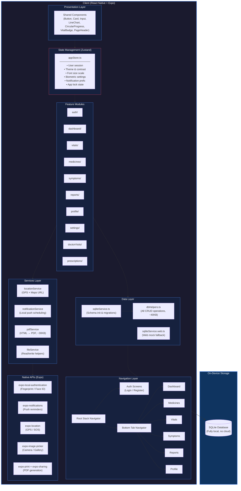
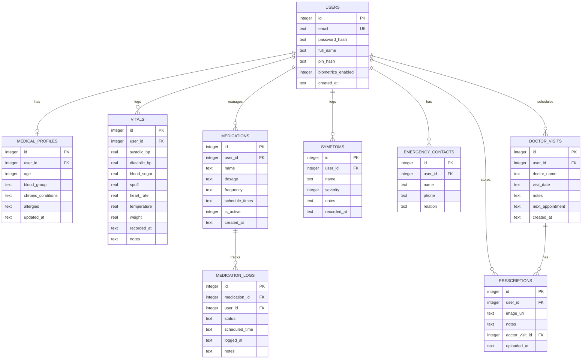
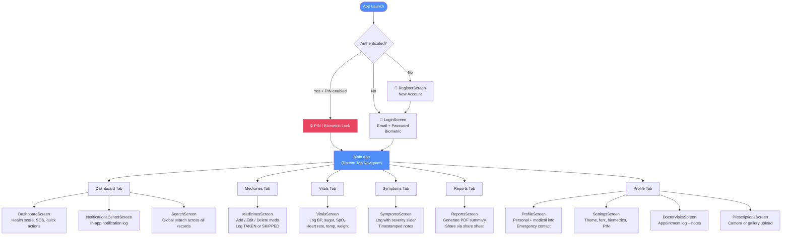
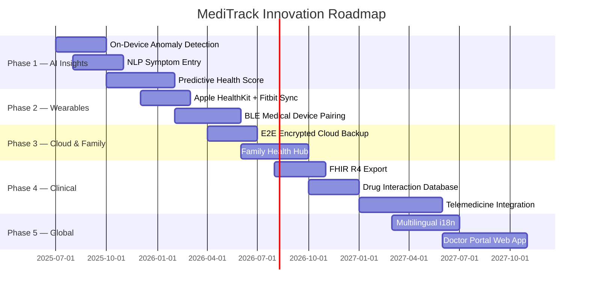

<div align="center">

# 🏥 MediTrack

### *Your Personal Health Companion — Offline, Private & Always Available*

[](https://reactnative.dev/)
[](https://expo.dev/)
[](https://www.typescriptlang.org/)
[](https://www.sqlite.org/)
[](https://expo.dev/)
[](LICENSE)

<br/>

> **MediTrack** is a fully offline, cross-platform personal health tracking app that empowers individuals to monitor vitals, manage medications, log symptoms, and generate shareable PDF health reports — all stored securely on-device with zero server dependency.

<br/>

[📱 Features](#-key-features) · [🏗️ Architecture](#️-system-architecture) · [🗄️ Database](#️-database-schema) · [🚀 Getting Started](#-getting-started) · [🔭 Roadmap](#-future-innovations)

</div>

---

##  Table of Contents

- [Overview](#-overview)
- [Key Features](#-key-features)
- [Tech Stack](#-tech-stack)
- [System Architecture](#️-system-architecture)
- [Database Schema](#️-database-schema)
- [Project Structure](#-project-structure)
- [App Navigation Flow](#-app-navigation-flow)
- [Getting Started](#-getting-started)
- [Build & Deployment](#-build--deployment)
- [Future Innovations](#-future-innovations)
- [Contributing](#-contributing)
- [License](#-license)

---

##  Overview

MediTrack solves a fundamental problem in personal healthcare: **fragmented, inaccessible health data**. Most health apps either require internet connectivity, lock data behind cloud subscriptions, or fail to work across all platforms.

MediTrack is built differently:

| Principle | Implementation |
|-----------|----------------|
|  **Privacy-First** | All data lives on the user's device via SQLite — nothing ever leaves |
|  **Offline-First** | Fully functional with zero network connectivity |
|  **Cross-Platform** | A single codebase for Android, iOS, and Web |
|  **Accessible** | High-contrast mode, 3 font-size scales, large tap targets |
|  **Emergency-Ready** | One-tap SOS with live GPS and medical profile sharing |

---

##  Key Features

| Feature | Description |
|---------|-------------|
|  **Biometric Auth** | Email/password login with fingerprint & Face ID + PIN lock |
|  **Daily Health Score** | Dynamic 0–100 score based on vitals logging and medication adherence |
|  **Medication Tracker** | Schedule meds with times; log TAKEN / SKIPPED per dose with reminders |
|  **Vitals Monitoring** | Track BP, blood sugar, SpO₂, heart rate, temperature & weight with trend charts |
|  **Symptom Logger** | Log symptoms with a severity slider (1–10) and timestamped notes |
|  **Emergency SOS** | One-tap share of name, blood group, conditions + live GPS coordinates |
|  **PDF Reports** | Auto-generate and share a comprehensive health summary PDF |
|  **Theme System** | Light / Dark mode + High Contrast + 3 responsive font-size scales |
|  **Smart Notifications** | Local push reminders for medications and upcoming doctor visits |
|  **Prescription Manager** | Camera / gallery upload for prescription image storage |
|  **Doctor Visits** | Log appointments, notes, and track next visit dates |
|  **Web Support** | Progressive Web App mode with graceful mock-DB fallback |

---

##  Tech Stack

### Core Framework

| Layer | Technology | Version |
|-------|-----------|---------|
| Framework | React Native | 0.85.3 |
| Runtime | Expo SDK | 56 |
| Language | TypeScript | 6.0 |
| Web Support | react-native-web | 0.21 |
| Distribution | EAS Build (Expo Application Services) | — |

### Key Libraries

| Category | Library | Purpose |
|----------|---------|---------|
| Navigation | `@react-navigation/native` | Stack + Tab navigation |
| State | `zustand` v4 | Global app state (auth, theme, settings) |
| Database | `expo-sqlite` v56 | Local offline storage |
| Forms | `react-hook-form` + `zod` v3 | Form management & schema validation |
| Animations | `react-native-reanimated` v4 | Fluid transitions |
| Icons | `lucide-react-native` v1.21 | Consistent icon set |
| Auth | `expo-local-authentication` | Biometric authentication |
| Notifications | `expo-notifications` | Local push reminders |
| Location | `expo-location` | GPS for SOS feature |
| PDF | `expo-print` + `expo-sharing` | Report generation & sharing |
| Media | `expo-image-picker` + `expo-document-picker` | Prescription uploads |

---

##  System Architecture

MediTrack follows a **layered, feature-based architecture** with a strict separation of concerns — each layer only communicates with the layer directly below it.



### Architecture Principles

- **Offline-First:** The SQLite layer is the single source of truth; no network calls are ever needed for core functionality.
- **Feature Isolation:** Each screen module in `src/features/` is self-contained and communicates with shared layers only through defined interfaces.
- **Platform Abstraction:** `sqliteService.web.ts` provides a transparent mock for browser environments, keeping feature code identical across platforms.
- **Single Store:** Zustand manages all global ephemeral state (session, theme, preferences), while SQLite handles all persisted domain data.

---

##  Database Schema

MediTrack uses a **normalized SQLite schema** with 9 tables. All records are user-scoped via `user_id` foreign keys.



### Table Descriptions

| Table | Description |
|-------|-------------|
| `users` | Account credentials, PIN hash, biometric toggle |
| `medical_profiles` | Static health profile — blood group, conditions, allergies |
| `vitals` | Time-series records for all vital signs |
| `medications` | Medication catalog with dosage, frequency, and schedule |
| `medication_logs` | Per-dose audit log (TAKEN / SKIPPED) for adherence tracking |
| `symptoms` | Timestamped symptom events with severity 1–10 |
| `emergency_contacts` | Contacts shared via SOS feature |
| `doctor_visits` | Appointment records with notes and follow-up dates |
| `prescriptions` | Image URIs for scanned/photographed prescriptions |

---

##  Project Structure

```
meditrack/
├── App.tsx                        # Root: navigation, auth gate, tab bar
├── index.ts                       # Entry point
├── app.json                       # Expo config (package, icons, permissions)
├── eas.json                       # EAS Build profiles (preview APK / production AAB)
├── tsconfig.json                  # TypeScript config (strict)
│
├── assets/                        # App icons, splash screen, fonts
│
└── src/
    ├── components/                # Shared reusable UI components
    │   ├── BackgroundGrid.tsx     # SVG decorative grid overlay
    │   ├── Button.tsx             # Primary / secondary / danger variants
    │   ├── Card.tsx               # Rounded card container
    │   ├── CircularProgress.tsx   # SVG health score gauge
    │   ├── IconContainer.tsx      # Rounded icon wrapper
    │   ├── Input.tsx              # Validated text input
    │   ├── LineChart.tsx          # Custom SVG vitals trend chart
    │   ├── PageHeader.tsx         # Screen header with back navigation
    │   └── VitalBadge.tsx         # Color-coded status (Normal / Borderline / Critical)
    │
    ├── config/
    │   └── theme.ts               # Color palette, dark / light / contrast modes, font scales
    │
    ├── database/
    │   ├── sqliteService.ts       # DB init, schema creation, migrations
    │   ├── sqliteService.web.ts   # Web platform mock (in-memory fallback)
    │   └── dbHelpers.ts           # All CRUD: users, vitals, meds, symptoms, reports (~40KB)
    │
    ├── features/
    │   ├── auth/                  # Login + Register screens
    │   ├── dashboard/             # Home, Notifications, Global Search
    │   ├── vitals/                # Vitals logging & trend view
    │   ├── medicines/             # Medication management & scheduling
    │   ├── symptoms/              # Symptom logger with severity
    │   ├── reports/               # PDF health report generator
    │   ├── profile/               # Personal & medical profile editor
    │   ├── settings/              # Theme, accessibility, security settings
    │   ├── doctorVisits/          # Appointment tracker
    │   └── prescriptions/         # Prescription image manager
    │
    ├── services/
    │   ├── locationService.ts     # GPS coordinates + Google Maps URL
    │   ├── notificationService.ts # Local push notification scheduler
    │   ├── pdfService.ts          # HTML → PDF report builder (~30KB)
    │   └── fileService.ts         # File read / write helpers
    │
    ├── store/
    │   └── appStore.ts            # Zustand store (auth, theme, preferences)
    │
    └── utils/
        └── calculations.ts        # Health score & medication adherence algorithms
```

---

##  App Navigation Flow



---

##  Getting Started

### Prerequisites

- [Node.js](https://nodejs.org/) v18 or higher
- [Expo CLI](https://docs.expo.dev/get-started/installation/) (`npm install -g expo-cli`)
- [EAS CLI](https://docs.expo.dev/eas/) for builds (`npm install -g eas-cli`)
- Expo Go app on your Android or iOS device (for development)

### Installation

```bash
# 1. Clone the repository
git clone https://github.com/aditi_sinha/meditrack.git
cd meditrack

# 2. Install dependencies
npm install

# 3. Start the development server
npx expo start
```

Scan the QR code with **Expo Go** (iOS/Android) or press `w` to open in the browser.

### Environment

No `.env` file is required. MediTrack has **no external APIs, no backend, and no authentication servers**. Everything runs locally.

---

##  Build & Deployment

| Target | Command | Output |
|--------|---------|--------|
| Development | `npx expo start` | Dev server + QR code |
| Android APK (preview) | `npx eas-cli build --platform android --profile preview` | `.apk` direct download |
| Android Store | `npx eas-cli build --platform android --profile production` | `.aab` for Play Store |
| iOS App Store | `npx eas-cli build --platform ios` | `.ipa` for App Store |
| Web | `npx expo export --platform web` | Static web bundle |

> **EAS Project ID:** `f0b7a96b-df1d-42fd-a297-bd4952cf5004`  
> **Android Package:** `com.gitadiiii.meditrack`  
> **Expo Owner:** `aditi_sinha`

---

##  Future Innovations

MediTrack's offline-first foundation is designed to scale. The following roadmap outlines planned innovations across intelligence, connectivity, and clinical integration.

### 🤖 Phase 1 — AI-Powered Health Insights *(Near-term)*

- **On-Device AI Triage:** A locally-run lightweight ML model (TensorFlow Lite / ONNX) that detects anomalous vital sign patterns and flags borderline readings before they become critical — completely offline.
- **Natural Language Symptom Entry:** Voice or free-text symptom logging parsed by an on-device NLP model to auto-classify severity and suggest related conditions.
- **Smart Medication Reminders:** Adaptive notification timing that learns from the user's TAKEN/SKIPPED history to send reminders at the highest-compliance windows.
- **Predictive Health Score:** Replace the rule-based scoring engine with an ML model trained on anonymized population data to produce a personalized wellness forecast.

### ⌚ Phase 2 — Wearable & IoT Integration *(Mid-term)*

- **Wearable Sync:** Automatic data ingestion from Apple Watch (HealthKit), Fitbit, Samsung Galaxy Watch (Health SDK), and Wear OS for continuous heart rate, SpO₂, sleep, and steps data.
- **Bluetooth Medical Devices:** Direct BLE pairing with consumer glucometers, smart blood-pressure cuffs, and pulse oximeters to eliminate manual data entry.
- **Continuous Monitoring Alerts:** Real-time threshold alerts for BLE-connected vitals devices even while the app runs in the background.

### ☁️ Phase 3 — Optional Cloud Sync & Family Health *(Mid-term)*

- **End-to-End Encrypted Cloud Backup:** Optional, user-initiated backup to the user's own cloud storage (iCloud, Google Drive) with AES-256 client-side encryption — Anthropic/MediTrack never sees the data.
- **Family Health Hub:** A caregiver view allowing parents or family members to monitor dependents (children, elderly relatives) across linked profiles on a single device.
- **Multi-Device Sync:** Conflict-free CRDT-based sync across a user's own devices without any central server storing plaintext data.

### 🏥 Phase 4 — Clinical & Ecosystem Integration *(Long-term)*

- **FHIR / HL7 Export:** Export health records in the FHIR R4 standard so data is directly importable into hospital EMR systems (Epic, Cerner) or shared with a GP via a QR code.
- **Telemedicine Integration:** In-app video consultation scheduling with pre-loaded health history context sent securely to the attending physician before the call.
- **Drug Interaction Checker:** Offline drug interaction database surfacing warnings when a new medication is added that conflicts with an existing one in the user's list.
- **Insurance & Wellness Rewards:** Opt-in anonymized health data sharing with insurers for premium discounts and wellness program integration.

### 🌍 Phase 5 — Accessibility & Global Reach *(Long-term)*

- **Multilingual Support (i18n):** Full localization starting with Hindi, Spanish, French, and Arabic to serve underserved healthcare markets.
- **Offline Community Health Worker Mode:** A simplified, low-literacy UI mode designed for community health workers in rural settings using pictographic interfaces.
- **AR Prescription Scan:** Augmented Reality overlay (via ARKit / ARCore) to scan a prescription and auto-populate medication name, dosage, and frequency.
- **Doctor Portal Web Dashboard:** A companion web app (Next.js) where authorized doctors can view a patient's shareable read-only health summary via a time-limited link.



---

##  Contributing

Contributions, issues, and feature requests are welcome!

```bash
# 1. Fork the repository
# 2. Create a feature branch
git checkout -b feature/amazing-feature

# 3. Commit your changes (follow Conventional Commits)
git commit -m "feat: add wearable sync module"

# 4. Push and open a Pull Request
git push origin feature/amazing-feature
```

Please follow the existing code style (TypeScript strict mode, `react-hook-form` + `zod` for all forms, Zustand for global state).


*MediTrack — Because your health data belongs to you.*

</div>
